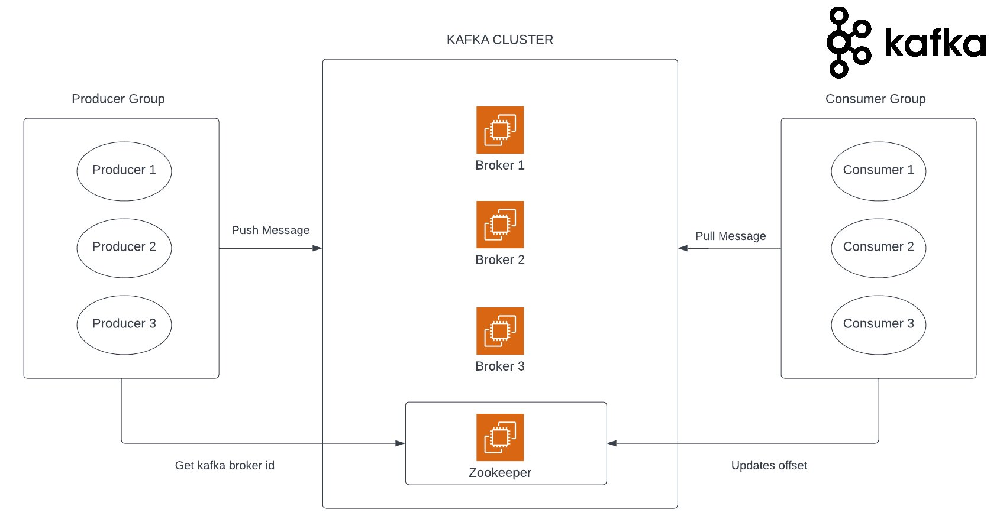
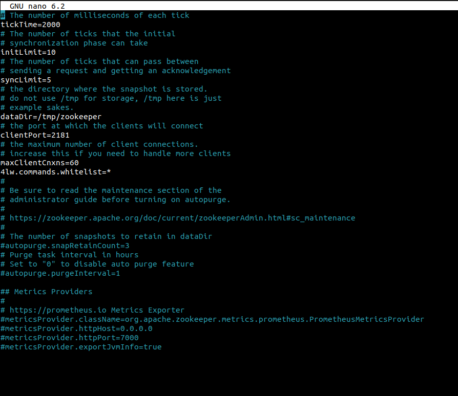

# Kafka Documentation
Kafka is a distributed streaming platform designed for high-throughput, fault-tolerant, and scalable data streaming. It provides a unified, real-time data pipeline for handling massive volumes of streaming data in a reliable and efficient manner. Kafka is widely used in modern data architectures, serving as a backbone for building real-time data pipelines, event-driven applications, and streaming analytics systems. Its versatility and robustness make it a popular choice for use cases such as log aggregation, data integration, messaging systems, and real-time analytics.



# Pre-Requisites
To set up Kafka, you'll need the following machines:

3 machines for Kafka brokers:

Ubuntu 16.04+ OS
2 CPUs
4 GB RAM
10 GB storage
1 machine for ZooKeeper:

Ubuntu 16.04+ OS
1 CPU
2 GB RAM
10 GB storage

## Setting up ZooKeeper
ZooKeeper is a centralized coordination service that plays a crucial role in distributed systems like Kafka. It acts as a highly reliable and fault-tolerant control center for managing the configuration, synchronization, and leader election within a Kafka cluster. ZooKeeper ensures consistency and coordination across all Kafka brokers, enabling fault tolerance and seamless failover in the event of node failures. By providing a robust and distributed coordination mechanism, ZooKeeper enables Kafka to operate smoothly, maintain data integrity, and guarantee the reliable processing of streaming data in a distributed environment.

### Step 1: Installing the necessary dependencies
One of the main dependencies used by Apache ZooKeeper is Java. You can install Java using the following commands:

```shell
# First, update the package manager
sudo apt update

# Install Java (Version 11)
sudo apt install openjdk-11-jdk
```

### Step-2: Installing Zookeeper
Zookeeper can be installed using the following link.

💡 As of now I am using version 3.8.1. You can checkout the zookeeper documentation for the latest version

```wget https://downloads.apache.org/zookeeper/zookeeper-3.8.1/apache-zookeeper-3.8.1-bin.tar.gz```

#### After this the tar file regarding zookeeper will be installed. To unzip that file, use the command
 ``` tar -xzf apache-zookeeper-3.8.1-bin.tar.gz```

#### Go into the zookeeper directory
``` cd  apache-zookeeper-3.8.1-bin```

#### Go into the conf directory and run the following command
```shell
 cd conf
mv zoo_sample.cfg zoo.cfg
```

 	
#### Make sure that you have these lines uncommented in the zoo.cfg file


#### Get out of this directory and run the following command to start zookeper
 ``` bin/zkServer.sh start```


Then run the following command to check if zookeeper is successfully running or not. If it is running successfully then this should be the output


## Setting up Kafka Brokers

I am documenting the setup of only one broker. The other two would be set up in the exact same manner. 

💡 Kafka also requires java as a dependency which can be installed by following the steps mentioned before.


### Step-1: Installing Kafka

Kafka can be installed using the following link. 

💡 As of now I am using version 2.13 - 3.5.0 as of now. Checkout the kafka documentation for the latest version

``` wget https://downloads.apache.org/kafka/3.5.0/kafka_2.13-3.5.0.tgz ```

#### This will install the tar file. Unzip this file and go into the kafka config directory.

```shell
 tar -xzf  kafka_2.13-3.5.0.tgz
cd kafka_2.13-3.5.0/config
```

#### Open the file named server.properties in this directory and make sure you have the following lines uncommented in the file

 ```shell
broker.id=1 (On the second broker it would be broker.id = 2 and so on. Basically , every broker should have a unique id)

listeners = PLAINTEXT://<your-private-IP>:9092
	
advertised.listeners=PLAINTEXT://<your-public-IP>:9092
listener.security.protocol.map=PLAINTEXT:PLAINTEXT,SSL:SSL,SASL_PLAINTEXT:SASL_PLAINTEXT,SASL_SSL:SASL_SSL

num.io.threads=8

socket.send.buffer.bytes=102400

log.dirs=/tmp/kafka-logs

num.partitions=1

num.recovery.threads.per.data.dir=1

offsets.topic.replication.factor=1

transaction.state.log.replication.factor=1

transaction.state.log.min.isr=1

log.retention.hours=168

log.retention.check.interval.ms=300000

zookeeper.connect=<Zookeeper-Public-IP>:2181

zookeeper.connection.timeout.ms=18000

group.initial.rebalance.delay.ms=0
```

#### Come out of the config directory and startup the kafka broker

```shell
 cd ..
 bin/kafka-server-start.sh config/server.properties
```

💡 These exact steps should be repeated on the other two brokers. Only the broker id and the listener and advertised listener IPs will be changed accordingly

##Visualization using kafdrop

Kafdrop is an open-source web-based tool designed to provide a user-friendly interface for monitoring and managing Apache Kafka clusters. It serves as a visual dashboard that allows users to easily observe and navigate through the various components of their Kafka infrastructure. Kafdrop offers a range of features, including real-time monitoring of Kafka topics, partitions, and consumer groups, as well as displaying detailed information about message offsets, lag, and data consumption. With its intuitive interface, Kafdrop simplifies the process of debugging, troubleshooting, and gaining insights into Kafka's messaging system. It serves as a valuable tool for developers, system administrators, and anyone working with Kafka to effectively manage and monitor their data streaming pipelines.

I use kafdrop using docker-compose. You can execute the following docker compose file in either your localhost or any remote server that is allowed to access your kafka cluster. 

```shell
version: '2'

networks:
  kafka-net:
    driver: bridge

services:
  kafdrop:
    image: obsidiandynamics/kafdrop
    networks:
      - kafka-net
    restart: "no"
    ports:
      - "9000:9000"
    environment:
      KAFKA_BROKERCONNECT: "PLAINTEXT://<BROKER-1-PUBLIC-IP>:9092,PLAINTEXT://<BROKER-2-PUBLIC-IP>:9092,PLAINTEXT://<BROKER-3-PUBLIC-IP>:9092"
      JVM_OPTS: "-Xms16M -Xmx48M -Xss180K -XX:-TieredCompilation -XX:+UseStringDeduplication -noverify"
```

Use ```docker-compose up``` to start kafdrop.
